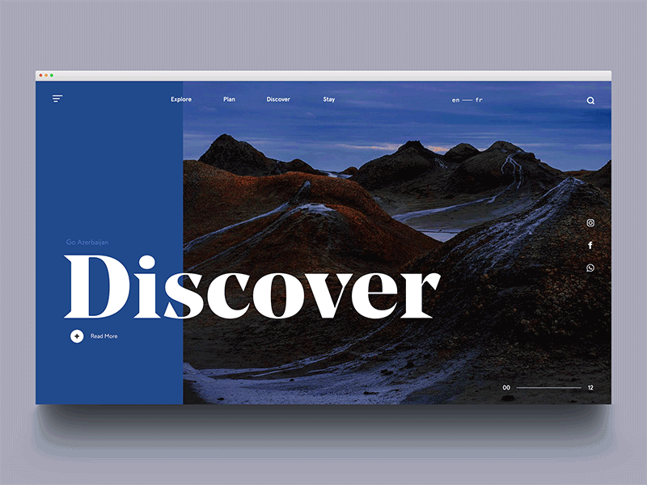

<h1>Udundi Coding Challenge</h1>
<a href="https://udundi-coding-challenge-sooty.vercel.app/"><b>Live Demo</b></a>
 
<h3>Framework Used:</h3>

<h3>Languages Used:</h3>

 
 
 
A simple coding challenge that involved mocking up a web page that was provided using HTML, CSS, and Javascript. The main focus was the animation.
 
 
<b>Reference:</b>

 
 
<b>Udundi Challenge:</b>

